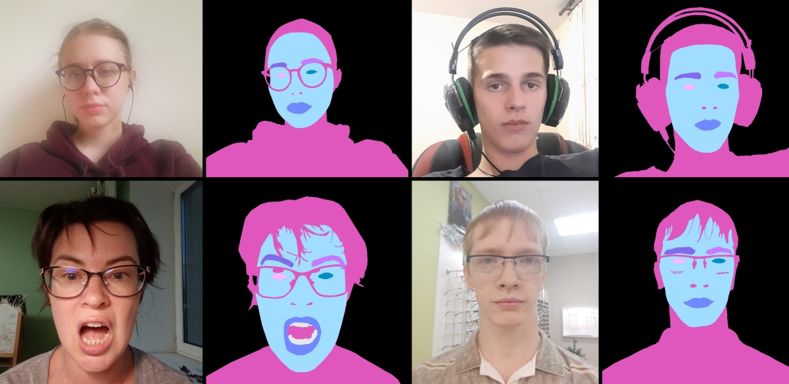
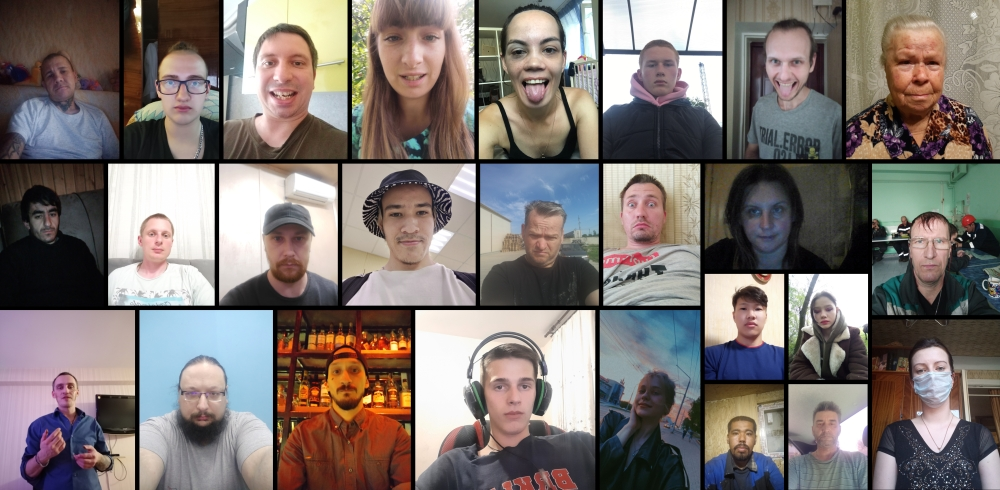

# EasyPortrait - Face Parsing and Portrait Segmentation Dataset
We introduce a large-scale image dataset **EasyPortrait** for portrait segmentation and face parsing. Proposed dataset can be used in several tasks, such as background removal in conference applications, teeth whitening, face skin enhancement, red eye removal or eye colorization, and so on. 

EasyPortrait dataset size is about **26GB**, and it contains **20 000** RGB images (~17.5K FullHD images) with high quality annotated masks. This dataset is divided into training set, validation set and test set by subject `user_id`. The training set includes 14000 images, the validation set includes 2000 images, and the test set includes 4000 images.

## Downloads

| Link                                  | Size |
|---------------------------------------|------|
| [`images`](https://sc.link/LNLr)      | 26G  |
| [`annotations`](https://sc.link/wPGX) | 235M |

### Structure
```
.
├── images.zip
│   ├── train/         # Train set: 14k
│   ├── val/           # Validation set: 2k
│   ├── test/          # Test set: 4k
├── annotations.zip
│   ├── meta.zip       # Meta-information (width, height, brightness, imhash, user_id)
│   ├── train/     
│   ├── val/       
│   ├── test/      
...
```

## Models
We provide some pre-trained models as the baseline for portrait segmentation and face parsing. We use mean Intersection over Union (mIoU) as the main metric. 

| Model Name                                     | Parameters (M) | Input shape | mIOU      |
|------------------------------------------------|----------------|-------------|-----------|
| [LR-ASPP + MobileNet-V3](https://sc.link/gBo6) | 1.14           | 1024 × 1024 | 73.13     |
| [FCN + MobileNet-V2](https://sc.link/9xZ3)     | 9.71           | 1024 × 1024 | 81.23     |
| [FPN + ResNet-50](https://sc.link/6r19)        | 28.5           | 512 × 512   | **83.13** |
| [BiSeNet-V2](https://sc.link/8wZo)             | 14.79          | 1024 × 1024 | 69.13     |
| [SegFormer-B0](https://sc.link/0lZX)           | 3.72           | 1024 × 1024 | 73.41     |
| [SegFormer-B2](https://sc.link/7vZA)           | 24.73          | 1024 × 1024 | 76.19     |

## Annotations

Annotations are presented as 2D-arrays, images in `*.png` format with several classes:

| Index | Class      |
|------:|:-----------|
|     0 | BACKGROUND |
|     1 | PERSON     |
|     2 | SKIN       |
|     3 | LEFT BROW  |
|     4 | RIGHT_BROW |
|     5 | LEFT_EYE   |
|     6 | RIGHT_EYE  |
|     7 | LIPS       |
|     8 | TEETH      |

Also, we provide some additional meta-information for dataset in `annotations/meta.zip` file:

|    | attachment_id | user_id | data_hash | width | height | brightness | train | test  | valid |
|---:|:--------------|:--------|:----------|------:|-------:|-----------:|:------|:------|:------|
|  0 | de81cc1c-...  | 1b...   | e8f...    |  1440 |   1920 |        136 | True  | False | False |
|  1 | 3c0cec5a-...  | 64...   | df5...    |  1440 |   1920 |        148 | False | False | True  |
|  2 | d17ca986-...  | cf...   | a69...    |  1920 |   1080 |        140 | False | True  | False |

where:
- `attachment_id` - image file name without extension
- `user_id` - unique anonymized user ID
- `data_hash` - image hash by using Perceptual hashing
- `width` - image width
- `height` - image height
- `brightness` - image brightness
- `train`, `test`, `valid` are the binary columns for train / test / val subsets respectively 

## Images


## Authors and Credits
- [Alexander Kapitanov](https://www.linkedin.com/in/hukenovs)
- [Karina Kvanchiani](https://www.linkedin.com/in/kvanchiani)
- [Sofia Kirillova](https://www.linkedin.com/in/gofixyourself/)

## Citation
You can cite the paper using the following BibTeX entry:

    @article{EasyPortrait,
        title={EasyPortrait - Face Parsing and Portrait Segmentation Dataset},
        author={Kapitanov, Alexander and Kvanchiani, Karina and Kirillova Sofia},
        journal={arXiv preprint <link>},
        year={2023}
    }

## License
<a rel="license" href="http://creativecommons.org/licenses/by-sa/4.0/"></a><br />This work is licensed under a variant of <a rel="license" href="http://creativecommons.org/licenses/by-sa/4.0/">Creative Commons Attribution-ShareAlike 4.0 International License</a>.

Please see the specific [license](https://github.com/hukenovs/easyportrait/blob/master/license/en_us.pdf).